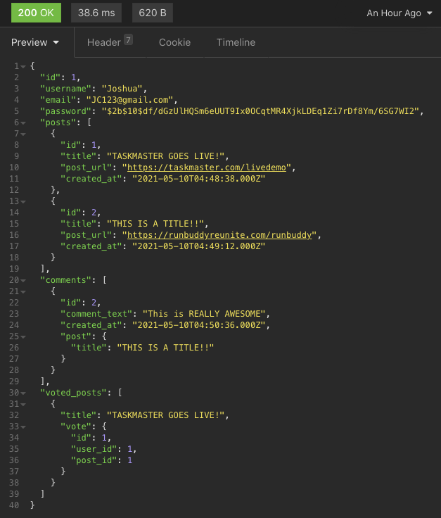

# just-tech-news

## Languages/Applications
* Javascript
* Express.JS
* Node.JS
* Sequelize ORM
* NPM - Nodemon/bcrypt
* MySQL
* Insomnia Core
* JawsDB

## Description
Just Tech News is a fully deployed backend application that connects Node's Express.JS with MySQL using Sequelize Object Relational Mapping (ORM). Just Tech News uses data models and relational databases to Create Read Update and Delete Users, Comments, and Posts, and allows users to vote/like posts.

* Created comment models that stored, comment text, user id's and post id's

* established various belongsTo and hasMany relationships included onetoMany and many to many.

* Exposed API endpoints that allow to GET, CREATE, and DELETE comments

* Deployed MySQL application to Heroku using JawsDB add-on
* Simplified complex SQL queries using sequelize and model methods
* Created assocations to connect multiple types of data

* Created a robut REST API with multiple endpoints

* Used ES6 async/await functionality to handle asynchronous code

* Protected user passwords by hashing with bcrypt 

* Setup groundwork for user authentication

* Performed raw SQL queries using Sequelize literals

## Deployed Application
https://safe-coast-85525.herokuapp.com/

## Reference Image
