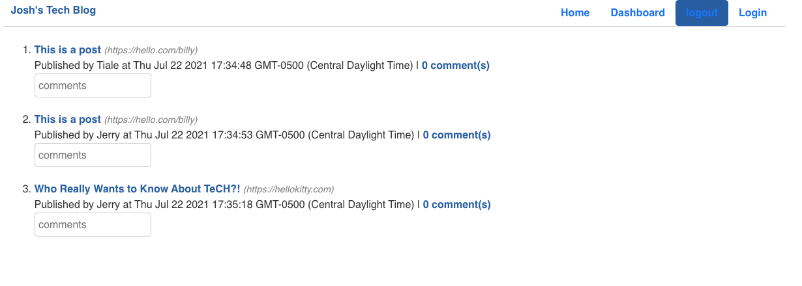

# Josh's Tech Blog

## Description
Joshua's Tech Blog is a responsive CMS-style blog site, similar to wordpress. Users are able to create accounts, login, create posts, and comment on each other's blogs. 

Joshua's Tech Blog was made with mySQL, Sequelize, and express-server for the backend, and used Handlebars.js as a template engine.

See more by visiting https://calm-thicket-37427.herokuapp.com/login  

## Languages
* Javascript
* HTML/CSS
* Bootstrap CDN
* Handlebars.js Template Engine
* mySQL / Sequelize - DB
* Express.js - Server
* Node.js
* Bcrypt - Password Encryption

# Reference Image
